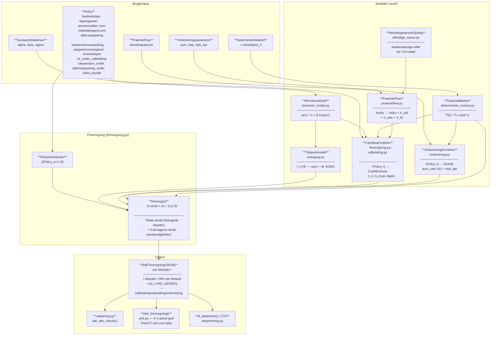
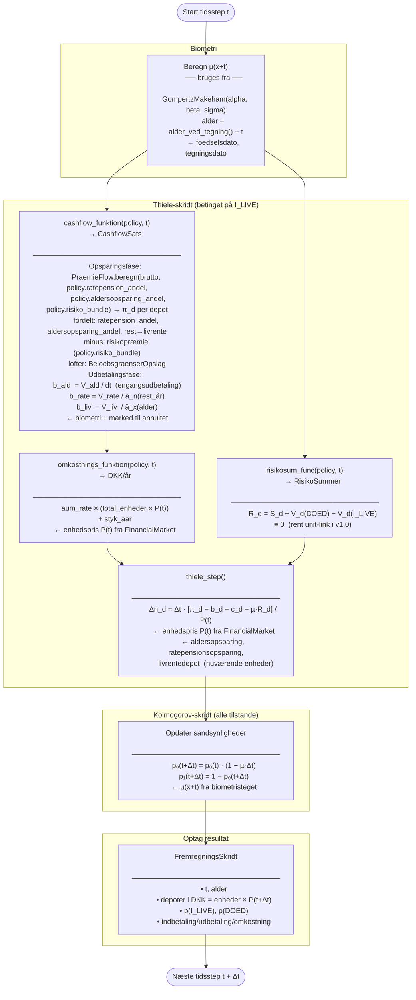

# Verd — Teknisk Dokumentation

**Version:** Phase 2 (cashflow-fremregning) — komplet
**Formål:** Sandsynlighedsvægtet fremregning af enkeltpolice reserver og cashflows for rene unit-link pensionsprodukter.

---

## 1. Overblik

Biblioteket beregner, hvordan en pensionspolices depot og betalingsstrømme forventes at udvikle sig over tid, givet usikkerhed om forsikringstagerens overlevelse. Produkterne er rene **markedsrenteprodukter** (unit-link) uden garantier — forsikringstager bærer selv den finansielle risiko.

Tre produkttyper understøttes som separate depoter:

| Depot | Udbetaling |
|---|---|
| Aldersopsparing | Engangsudbetaling ved pensionering |
| Ratepension | Fast månedlig ydelse over *n* år |
| Livrente | Månedlig ydelse så længe forsikringstager lever |

---

## 2. Markov-modellen

Policens tilstand modelleres som en **to-tilstands Markov-kæde** i diskret tid:

```
I_LIVE  ──µ(x)──►  DOED
```

| Tilstand | Beskrivelse |
|---|---|
| `I_LIVE` | Forsikringstager er i live og policen er aktiv |
| `DOED` | Forsikringstager er død — absorberende tilstand |

**Tilstandsfordelingen** på tidspunkt $t$ angiver sandsynligheder:

$$p_0(t) = P(\text{I\_LIVE på tidspunkt } t), \quad p_1(t) = P(\text{DOED på tidspunkt } t)$$

med $p_0(t) + p_1(t) = 1$.

### Sandsynlighedsopdatering — Kolmogorov fremadligning

For hvert tidsstep $[t, t+\Delta t]$ opdateres sandsynlighederne via den diskretiserede Kolmogorov fremadligning:

$$p_0(t + \Delta t) = p_0(t) \cdot \bigl(1 - \mu(x+t) \cdot \Delta t\bigr)$$
$$p_1(t + \Delta t) = p_1(t) + p_0(t) \cdot \mu(x+t) \cdot \Delta t$$

hvor $\mu(x+t)$ er **dødelighedsintensiteten** (se afsnit 3) og $x$ er alder ved tegning.

Intuition: i hvert tidsstep "forlader" sandsynlighedsmassen $\mu \cdot p_0 \cdot \Delta t$ tilstanden I_LIVE og overføres til DOED.

### Tilstandsmodel og overgange (`overgang.py`)

Markov-grafen er repræsenteret som en generisk `Tilstandsmodel`, der indeholder en liste af `Overgang`-objekter. Hvert objekt beskriver én rettet overgang:

```python
Overgang(
    fra        = PolicyState.I_LIVE,
    til        = PolicyState.DOED,
    intensitet = BiometriOvergangsIntensitet(biometric_model),
    risikosum_func = nul_risikosum,   # standard for rent unit-link
)
```

`OvergangsIntensitet` er en abstrakt klasse med to implementationer:
- `BiometriOvergangsIntensitet` — wrapper om en `BiometricModel`; returnerer $\mu(x)$
- `KonstantOvergangsIntensitet` — fast intensitet uafhængig af alder

Fabriksfunktionen `standard_toetilstands_model(biometric)` returnerer den normale to-tilstands model med ét Overgang-objekt.

---

## 3. Dødelighedsmodel — Gompertz-Makeham

Dødelighedsintensiteten (force of mortality) er:

$$\mu(x) = \alpha + \beta \cdot e^{\sigma x}$$

| Parameter | Fortolkning | Typisk dansk mand |
|---|---|---|
| $\alpha$ | Aldersuafhængig baggrundsdødelighed (ulykker, sygdom) | 0,0005 |
| $\beta$ | Gompertz præfaktor | 0,00004 |
| $\sigma$ | Aldringens vækstrate | 0,09 |

Enheden er år$^{-1}$: en 65-årig mand med disse parametre har $\mu(65) \approx 0{,}009$, svarende til ca. 0,9 % dødelighedsintensitet per år.

**Fra intensitet til sandsynlighed:** Overlevelsessandsynlighed over ét tidsstep:

$$P(\text{overlever } [t, t+\Delta t]) = e^{-\mu(x+t) \cdot \Delta t}$$

---

## 4. Finansielt marked — deterministisk unit-link

Policens depoter er investeret i en fond med **enhedspris** (NAV):

$$P(t) = P_0 \cdot e^{r \cdot t}$$

hvor $r$ er den kontinuerte årlige afkastrate og $P_0$ er startprisen. Depot­værdien i DKK er:

$$V(t) = n(t) \cdot P(t)$$

hvor $n(t)$ er antallet af enheder. Det finansielle afkast er *implicit* — det fremkommer automatisk af, at $P(t)$ stiger med $e^{r \cdot \Delta t}$ per tidsstep, uden at enhedsantallet ændres.

**Antagelse:** Markedet er deterministisk — ingen stokastisk afkastusikkerhed i v1.0.

**Design:** `FinancialMarket` er fuldt uafhængig af `BiometricModel`; de kobles kun i fremregningslaget.

---

## 5. Thieles differentialligning

Thieles ligning er den centrale ODE, der driver depotudviklingen. Den kan udledes som et **konsistenskrav** (no-arbitrage): depotets vækst pr. tidsenhed skal svare til afkast plus indbetalinger minus udbetalinger minus den forventede udgift til biometriske risici.

For depot $d$ i tilstand I_LIVE:

$$\frac{dV_d}{dt} = r \cdot V_d(t) + \pi_d(t) - b_d(t) - c_d(t) - \mu(x+t) \cdot R_d(t)$$

Hvert led har en klar fortolkning:

| Led | Symbol | Fortolkning |
|---|---|---|
| Afkast | $r \cdot V_d$ | Depot vokser med afkastraten |
| Indbetaling | $\pi_d$ | Præmieindbetaling til depot $d$ (DKK/år) |
| Udbetaling | $b_d$ | Pensionsydelse fra depot $d$ (DKK/år) |
| Omkostning | $c_d$ | Forvaltningsomkostning (DKK/år) |
| Biometrisk led | $\mu \cdot R_d$ | Forventet udgift til forsikringsdækning |

### Risikosummen $R_d$

Risikosummen er det nettobeløb, der skal afregnes ved overgang til DOED:

$$R_d = S_d + V_d^{\text{DOED}} - V_d^{\text{I\_LIVE}}$$

- $S_d$: ekstern dødsfaldsdækning på depot $d$ (dødelsydelse)
- $V_d^{\text{DOED}}$: depotets hensættelse i DOED-tilstanden
- $V_d^{\text{I\_LIVE}}$: depotets nuværende værdi

Værdien af risikosummen afhænger af `policy.doedsydelses_type` (se afsnit 5.1).

### 5.1 DoedsydelsesType — hvad sker ved forsikringstagers død?

`DoedsydelsesType` (enum på `Policy`) styrer dødelsydelsen i opsparingsfasen:

| Enum-værdi | Matematisk | Risikosum | Effekt |
|---|---|---|---|
| `DEPOT` | $S_d = V_d$, $V_d^{\text{DOED}} = 0$ | $R_d = V_d + 0 - V_d = 0$ | Ingen dødelighedsgevinster |
| `INGEN` | $S_d = 0$, $V_d^{\text{DOED}} = 0$ | $R_d = 0 + 0 - V_d = -V_d$ | Dødelighedsgevinster til overlevende |

**DEPOT (depotsikring):** Depotværdien udbetales til efterladte ved død. Risikosummen er nul — risikopræmien $\mu \cdot R_d = 0$ bidrager ikke til depotudviklingen. Kun gyldigt i opsparingsfasen.

**INGEN:** Ingen dødelsydelse. Risikosummen er negativ: $R_d = -V_d < 0$. Det biometriske led bliver $-\mu \cdot R_d = \mu \cdot V_d > 0$, som *øger* de overlevendes forventede depot (dødelighedsgevinster).

**Konsekvens:** Forventet samlet udbetaling er højere med `INGEN` end med `DEPOT` — de overlevende nyder godt af de afdødes frigivne reserver.

**Fabriksfunktion:** `beregn_risikosum_funktion(market)` returnerer en `RisikosumFunktion` der dispatcher på `policy.doedsydelses_type` ved runtime. Brug den som `risikosum_func` i `Overgang`:

```python
risikosum_func = beregn_risikosum_funktion(marked)
tilstandsmodel = Tilstandsmodel(overgange=[
    Overgang(
        fra=PolicyState.I_LIVE, til=PolicyState.DOED,
        intensitet=BiometriOvergangsIntensitet(biometri),
        risikosum_func=risikosum_func,
    )
])
```

`nul_risikosum` returnerer altid $R_d = 0$ (tilsvarende `DEPOT`-adfærd, uanset `doedsydelses_type`).

### Diskretisering — Euler fremadskridende

Da depotet opbevares som *enheder* $n_d = V_d / P(t)$ (og afkastleddet dermed er implicit), reduceres Thiele til:

$$\Delta n_d = \Delta t \cdot \frac{\pi_d - b_d - c_d - \mu \cdot R_d}{P(t)}$$

**Rækkefølge inden for hvert tidsstep:**
1. Indbetalinger ($\pi_d \cdot \Delta t$) tilskrives som nye enheder ved $P(t)$
2. Finansielt afkast: implicit via $P(t) \to P(t + \Delta t) = P(t) \cdot e^{r \Delta t}$
3. Biometrisk koblingsled ($-\mu \cdot R_d \cdot \Delta t$) fratrækkes ved $P(t)$
4. Udbetalinger og omkostninger ($-(b_d + c_d) \cdot \Delta t$) fratrækkes ved $P(t)$

---

## 6. Fremregningsalgoritmen

Systemet fremregnes med månedlige tidsstep $\Delta t = 1/12$:

```
For hvert tidsstep [t, t + Δt]:

  1. Beregn µ(x+t) fra Gompertz-Makeham

  2. Thiele-skridt (betinget depotfremregning):
     Δn_d = Δt · [π_d − b_d − c_d − µ·R_d] / P(t)
     → opdaterede betingede depoter givet I_LIVE

  3. Kolmogorov-skridt (sandsynlighedsopdatering):
     p₀(t+Δt) = p₀(t) · (1 − µ·Δt)
     p₁(t+Δt) = 1 − p₀(t+Δt)

  4. Output for dette tidsstep:
     - Betinget depot givet I_LIVE:   V_d(t+Δt | I_LIVE)
     - Sandsynlighedsvægtet depot:    p₀(t+Δt) · V_d(t+Δt | I_LIVE)
     - Overlevelsessandsynlighed:     p₀(t+Δt)
```

**Output** er en tidsserie (`list[FremregningsSkridt]`) med én post per måned, der indeholder alle depotværdier, sandsynligheder og cashflows. `FremregningsSkridt` aggregerer et `TilstandsSkridt` per Markov-tilstand med betingede og sandsynlighedsvægtede størrelser.

---

## 7. Udbetalingsfasen

Når `er_under_udbetaling = True` stopper indbetalingerne og ydelserne beregnes:

**Ratepension** (fast ydelse over $n$ år):

$$b_{\text{rate}}(t) = \frac{V_{\text{rate}}(t)}{\ddot{a}_n^{(12)}}$$

hvor $\ddot{a}_n^{(12)} = \sum_{k=0}^{12n-1} \frac{1}{12} \cdot e^{-r \cdot k/12}$ er den diskonterede annuitetsfaktor (sikker annuitet, ingen biometri).

**Livrente** (livsvarig ydelse):

$$b_{\text{liv}}(t) = \frac{V_{\text{liv}}(t)}{\ddot{a}_x^{(12)}}$$

hvor $\ddot{a}_x^{(12)} = \sum_{k=0}^{K} \frac{1}{12} \cdot e^{-r \cdot k/12} \cdot {}_k p_x$ er den livsvarige annuitetsfaktor (beregnet numerisk med max-alder 120 år).

**Aldersopsparing** udbetales som et engangsudbetaling i det første udbetalingstep: $b_{\text{ald}} = V_{\text{ald}} / \Delta t$ (tømmer depotet i ét skridt).

Annuitetsfaktorerne genberegnes ved hvert tidsstep, så ydelsen afspejler den aktuelle depotværdi og resterende løbetid.

---

## 8. Præmieallokering — PraemieFlow

`PraemieFlow` (`praemieflow.py`) indeholder de skattemæssige beløbsgrænser der skal overholdes ved fordeling af nettopræmien. De police-specifikke allokeringsønsker (`ratepension_andel`, `aldersopsparing_andel`) og risikodækninger (`risiko_bundle`) er felter på `Policy`.

### Algoritme

```
Nettopræmie = Bruttopræmie − Risikopræmie

Ønsket fordeling:
  Ratepension     = Nettopræmie × ratepension_andel
  Aldersopsparing = Nettopræmie × aldersopsparing_andel
  Livrente        = Resterende (ingen loft)

Anvend lofter (BeloebsgraenserOpslag):
  Ratepension     ≤ ratepension_max
  Aldersopsparing ≤ aldersopsparing_max
  Overskydende beløb flyttes til livrente
```

`PraemieFlowResultat` returnerer de endelige beløb og garanterer at summen altid er lig bruttopræmien (invariant).

### Risikodækning — RisikoBundle

`RisikoBundle` (`risiko.py`) samler én eller flere `RisikoDaekning`-objekter:

```python
RisikoDaekning(navn="Dødsfald", aarlig_praemie_dkk=500.0)
```

Eksempel — standard bundtet med tre dækningstyper:

```python
STANDARD_RISIKO_BUNDLE = RisikoBundle([
    RisikoDaekning("Dødsfald",       aarlig_praemie_dkk=500.0),
    RisikoDaekning("TAE",            aarlig_praemie_dkk=700.0),  # Tab af erhvervsevne
    RisikoDaekning("SUL",            aarlig_praemie_dkk=300.0),  # Svær ulykke/livstruende
])  # Total: 1.500 DKK/år
```

Risikopræmien fratrækkes bruttopræmien, inden nettopræmien fordeles på depoterne.

---

## 9. Offentlige satser og beløbsgrænser

`BeloebsgraenserOpslag` (`offentlige_satser.py`) indkapsler de skattemæssige indbetalingsgrænser for et givet indkomstår. Disse bruges af `PraemieFlow` til at sikre, at indbetalingerne til ratepension og aldersopsparing ikke overstiger de lovbestemte lofter.

**Aldersopsparing:** Grænsen er højere for forsikringstagere **7 år eller mindre fra folkepensionsalder** ("nær pension"):

```python
# Eksempel med 2026-satser
opslag = BeloebsgraenserOpslag.fra_satser(
    satser             = indlæs_offentlige_satser(filsti),
    aar                = 2026,
    aar_til_folkepension = 5,   # ≤ 7 → nær-pensionssats
)
```

Satserne er gemt i `verd/data/offentlige_satser.csv` med kolonner `produkt`, `aar`, `beloebsgraense_dkk`, `betingelse`. Filen indeholder data for 2025 og 2026.

| Betingelse | Aldersopsparing | Ratepension |
|---|---|---|
| Normal (`normal`) | Lav grænse | Grænse |
| Nær pension (`nær_pension`) | Høj grænse | Grænse |
| Livrente | Ingen grænse | — |

---

## 10. Omkostningsmodel

`OmkostningsFunktion` er en callable `(Policy, float) → float` (DKK/år). To implementationer:

- `nul_omkostning` — returnerer altid 0,0 (standard hvis ikke angivet)
- `standard_omkostning(market, aum_rate=0.005, styk_aar=200.0)` — fabrik der returnerer:

$$c(t) = \text{aum\_rate} \cdot V_{\text{total}}(t) + \text{styk\_aar}$$

Dvs. 0,5 % af samlet depotværdi per år plus 200 DKK fast per år.

### Omkostningsindtægt vs. faktisk policeudgift

`fremregn()` accepterer to separate omkostningsfunktioner:

| Parameter | Rolle | Påvirker depot? |
|---|---|---|
| `omkostnings_funktion` | Omkostningsindtægt — hvad selskabet opkræver kunden | Ja (trækkes fra via Thiele) |
| `faktisk_udgift_funktion` | Faktisk policeudgift — hvad selskabet reelt afholder | Nej (kun sporet) |

Differensen eksporteres som `omkostningsresultat_dkk` i CSV/DataFrame:

$$\text{omkostningsresultat}(t) = \text{omkostning\_dkk}(t) - \text{faktisk\_udgift\_dkk}(t)$$

Positivt resultat betyder selskabet tjener mere end det bruger på policen i det pågældende tidsstep. Begge felter er nul i skridt ved $t_0$.

Eksempel: selskabet opkræver 0,5 % AUM + 200 DKK/år, men bruger kun 0,3 % AUM + 500 DKK/år i faktiske driftsomkostninger:

```python
skridt = fremregn(
    ...,
    omkostnings_funktion=standard_omkostning(marked, aum_rate=0.005, styk_aar=200.0),
    faktisk_udgift_funktion=standard_omkostning(marked, aum_rate=0.003, styk_aar=500.0),
)
```

---

## 11. Validering

`validering.py` indeholder sanity checks der kan køres efter fremregningen:

| Funktion | Tjekker |
|---|---|
| `check_sandsynligheder(fordeling)` | Sandsynligheder summer til 1,0 ± tolerence |
| `check_p_alive_monoton(skridt)` | $p(\text{I\_LIVE})$ er monotont aftagende |
| `kør_alle_checks(police, skridt, marked)` | Kører begge ovenstående checks |

Funktionerne kaster `ValueError` ved overtrædelse.

---

## 12. Visualisering og output

### 12.1 Plot-funktioner

To offentlige funktioner i `plot.py`:

| Funktion | Input | Beskrivelse |
|---|---|---|
| `plot_fremregning(skridt, ...)` | `list[FremregningsSkridt]` | Plot direkte fra fremregningsresultater |
| `plot_fra_dataframe(df, ...)` | `pd.DataFrame` (fra CSV) | Plot fra CSV indlæst med `pd.read_csv()` |

Begge funktioner deler identisk layout og parametre:

| Parameter | Type | Beskrivelse |
|---|---|---|
| `titel` | `str` | Figurtitel |
| `pensionsalder_t` | `float \| None` | Tidspunkt (år fra tegning) for pensionsalder — markeres som stiplet linje |
| `figsize` | `tuple[float, float]` | Figurstørrelse i tommer |
| `gem_fil` | `str \| None` | Filsti til at gemme figuren (PNG); `None` = ikke gemt |
| `ald_lumpsum_dkk` | `float \| None` | (Kun `plot_fra_dataframe`) — engangsudbetaling fra aldersopsparing, annoteres i ydelsespanelet |

### 12.2 Panelstruktur

Layoutet er **fire faste paneler** plus **ét betinget panel** for omkostningsresultat:

```
┌─────────────────────────────────────────────────────────────────┐
│ Panel 1 — Betingede depoter (givet I_LIVE)                      │
│   V_d(t | I_LIVE) for hvert produkt — stacked area              │
├─────────────────────────────────────────────────────────────────┤
│ Panel 2 — Sandsynlighedsvægtede depoter                         │
│   E[V_d(t)] = p(I_LIVE) · V_d(t | I_LIVE) — stacked area       │
├─────────────────────────────────────────────────────────────────┤
│ Panel 3 — Ydelser (DKK/år)                                      │
│   Udbetalingsrater per produkt i udbetalingsfasen               │
├─────────────────────────────────────────────────────────────────┤
│ Panel 4 — Overlevelsessandsynlighed p(I_LIVE)                   │
├─────────────────────────────────────────────────────────────────┤
│ Panel 5 — Omkostningsresultat (kun hvis cost-data er ikke-nul)  │
│   Kumulativ opkrævet omkostning vs. faktisk udgift              │
│   Grøn fyld = positivt resultat; rød fyld = negativt resultat   │
└─────────────────────────────────────────────────────────────────┘
```

**Panel 5 aktiveres automatisk** hvis `fremregn()` er kaldt med en `faktisk_udgift_funktion` der giver ikke-nul værdier (eller `omkostnings_funktion` er ikke-nul). Ingen kode-ændring er nødvendig i kaldende kode.

### 12.3 CSV-kolonner og DataFrame-output

`til_dataframe(skridt)` og `eksporter_cashflows_csv(skridt, filsti)` producerer følgende kolonner:

| Kolonne | Enhed | Beskrivelse |
|---|---|---|
| `t` | år | Tid fra tegningsdato |
| `alder` | år | Forsikringstagers alder |
| `p_i_live` | — | Overlevelsessandsynlighed |
| `indbetaling_dkk` | DKK/skridt | Indbetaling i tidssteppet |
| `udbetaling_dkk` | DKK/skridt | Udbetaling i tidssteppet |
| `omkostning_dkk` | DKK/skridt | Omkostningsindtægt (opkrævet, trækkes fra depot) |
| `faktisk_udgift_dkk` | DKK/skridt | Faktisk policeudgift (sporet, påvirker ikke depot) |
| `omkostningsresultat_dkk` | DKK/skridt | `omkostning_dkk − faktisk_udgift_dkk` |
| `enhedspris` | DKK/enhed | Enhedspris P(t) |
| `betinget_aldersopsparing_dkk` | DKK | Betinget depot — aldersopsparing |
| `betinget_ratepension_dkk` | DKK | Betinget depot — ratepension |
| `betinget_livrente_dkk` | DKK | Betinget depot — livrente |
| `betinget_depot_dkk` | DKK | Sum af betingede depoter |
| `forventet_aldersopsparing_dkk` | DKK | Sandsynlighedsvægtet depot — aldersopsparing |
| `forventet_ratepension_dkk` | DKK | Sandsynlighedsvægtet depot — ratepension |
| `forventet_livrente_dkk` | DKK | Sandsynlighedsvægtet depot — livrente |
| `forventet_depot_dkk` | DKK | Sandsynlighedsvægtet total depot |
| `b_aldersopsparing` | DKK/år | Cashflow-rate — aldersopsparing |
| `b_ratepension` | DKK/år | Cashflow-rate — ratepension |
| `b_livrente` | DKK/år | Cashflow-rate — livrente |
| `b_omkostning` | DKK/år | Samlet omkostningsrate (= `cashflows_i_live.omkostning`) |

`faktisk_udgift_dkk` og `omkostningsresultat_dkk` er nul i alle tidsstep hvis ingen `faktisk_udgift_funktion` er angivet til `fremregn()`.

---

## 13. Centrale antagelser

| # | Antagelse | Implikation |
|---|---|---|
| A1 | **To tilstande** — kun I_LIVE og DOED | Invalid, fripolice og genkøb er ikke modelleret |
| A2 | **Deterministisk finansielt marked** | Ingen afkastusikkerhed; $r$ er konstant over hele perioden |
| A3 | **Gompertz-Makeham dødelighed** — tidshomogen | Samme dødelighedsintensitet i hele fremregningsperioden; ingen fremtidig dødelighedsforbedring |
| A4 | **Dødelsydelse styret af `DoedsydelsesType`** | `DEPOT`: $R_d = 0$ (depotsikring, ingen dødelighedsgevinster); `INGEN`: $R_d = -V_d$ (dødelighedsgevinster til overlevende) |
| A5 | **Diskret tid** — $\Delta t = 1/12$ | Euler-diskretisering; numerisk fejl er $O(\Delta t^2) \approx 0{,}007$ pr. skridt |
| A6 | **Indbetaling proportional til depotandele** | Indbetalingen fordeles til de tre depoter i samme forhold som deres aktuelle størrelse (ligeligt hvis alle depoter er nul) |
| A7 | **`er_under_udbetaling` er eksplicit** | Systemet skifter *ikke* automatisk til udbetaling ved pensionsalderen — dette styres af kalderen |
| A8 | **Annuitetsfaktorer genberegnes ved hvert step** | Ydelsen ændrer sig månedligt med den resterende depotværdi og resterende løbetid |
| A9 | **Risikopræmier er eksterne** | `RisikoBundle` fratrækkes bruttopræmien; ingen kobling til `RisikoSummer`/biometri i fremregningslaget |

---

## 14. Eksempel — Konkrete inputparametre

```python
from datetime import date
from verd import (
    GompertzMakeham, DeterministicMarket, Policy, PolicyState,
    PraemieFlow, RisikoBundle, RisikoDaekning,
    standard_toetilstands_model, fremregn,
    udbetaling_cashflow_funktion, praemieflow_cashflow_funktion,
    standard_omkostning, kør_alle_checks,
)

# Dødelighedsmodel (dansk mand, G82-lignende)
biometri = GompertzMakeham(alpha=0.0005, beta=0.00004, sigma=0.09)

# Finansielt marked (5 % p.a. kontinuert afkast)
marked = DeterministicMarket(r=0.05, enhedspris_0=100.0)

# Risikodækning
risiko = RisikoBundle([
    RisikoDaekning("Dødsfald", 500.0),
    RisikoDaekning("TAE",      700.0),
    RisikoDaekning("SUL",      300.0),
])

# Police (opsparing) — allokeringsønsker og risikodækning ligger på policen
police = Policy.fra_dkk(
    foedselsdato         = date(1980, 1, 15),
    tegningsdato         = date(2020, 6, 1),   # alder ≈ 40,4 år
    pensionsalder        = 67,
    loen                 = 600_000,            # DKK/år
    indbetalingsprocent  = 0.15,               # 90.000 DKK/år brutto
    ratepensionsopsparing_dkk = 80_000,
    ratepensionsvarighed = 10,                 # år
    livrentedepot_dkk    = 50_000,
    marked               = marked,
    ratepension_andel    = 0.60,               # 60 % af nettopræmie til ratepension
    aldersopsparing_andel = 0.20,              # 20 % til aldersopsparing
    risiko_bundle        = risiko,
)

# PraemieFlow indeholder kun beløbsgrænser (offentlige satser)
praemieflow = PraemieFlow(beloebsgraenser=None)  # ingen lofter her

# Fremregning — opsparingsfase (26,6 år til pension)
tilstandsmodel   = standard_toetilstands_model(biometri)
cashflow_funk    = praemieflow_cashflow_funktion(praemieflow)
omkostning_funk  = standard_omkostning(marked, aum_rate=0.005, styk_aar=200.0)
fordeling        = [(police, 1.0)]

antal_skridt_opsp = round(26.6 * 12)
skridt_opsp = fremregn(fordeling, antal_skridt_opsp, marked,
                       tilstandsmodel, cashflow_funk, omkostning_funk)

kør_alle_checks(police, skridt_opsp, marked)
```

**Typisk output ved pensionsalder (t ≈ 26,6 år):**

| Størrelse | Værdi |
|---|---|
| Overlevelsessandsynlighed $p_0$ | ≈ 0,963 |
| Ratepension (betinget depot) | ≈ 750.000 DKK |
| Livrente (betinget depot) | ≈ 475.000 DKK |
| Total betinget depot | ≈ 1.225.000 DKK |

---

## 15. Arkitektur og dataflow

### Diagram 1 — Overordnet modulstruktur



---

### Diagram 2 — Algoritme per tidsstep

Viser præcis hvad der sker inde i `fremregn()` for ét tidsstep $[t,\, t+\Delta t]$, og hvilke inputfelter der bruges hvornår.



---

### Tabel — Policy-felternes rolle i systemet

| Policy-felt | Bruges i | Formål |
|---|---|---|
| `foedselsdato`, `tegningsdato` | `alder_ved_tegning()` → `fremregn()` | Beregner alder $x+t$ ved hvert tidsstep |
| `loen`, `indbetalingsprocent` | `simpel_opsparings_cashflow()` | Beregner bruttopræmiesats $\pi = \ell \times p$ |
| `aldersopsparing`, `ratepensionsopsparing`, `livrentedepot` | `thiele_step()`, `omkostning`, `udbetaling` | Nuværende depotstørrelser i enheder — opdateres hvert step |
| `ratepensionsvarighed` | `udbetaling_cashflow_funktion()` | Beregner resterende udbetalingsperiode for $\ddot{a}_n$ |
| `er_under_udbetaling` | Alle cashflow-funktioner | Brancher mellem opsparings- og udbetalingslogik |
| `pensionsalder` | Kaldende kode | Bestemmer antal skridt i opsparingsfasen (`t_pension`) — bruges **ikke** direkte af `fremregn()` |
| `tilstand` | `fremregn()`, `thiele_step()` | Identificerer hvilken Markov-tilstand policyen tilhører |
| `risiko_bundle` | `praemieflow_cashflow_funktion()` via `PraemieFlow.beregn()` | Risikopræmie fratrukket bruttopræmien inden depotallokering |
| `ratepension_andel`, `aldersopsparing_andel` | `praemieflow_cashflow_funktion()` via `PraemieFlow.beregn()` | Kundens ønskede fordeling af nettopræmien på depoterne |
| `gruppe_id`, `omkostningssats_id` | *(opslagsnøgler — fremtidig brug)* | Reserveret til fremtidig tabelopslag |

---

## 16. Moduloversigt

| Fil | Indhold |
|---|---|
| `policy_state.py` | `PolicyState` enum (I_LIVE, DOED) |
| `policy.py` | `Policy` dataklasse |
| `policy_distribution.py` | `PolicyDistribution` type + `initial_distribution()` |
| `biometric_model.py` | `BiometricModel` ABC |
| `gompertz_makeham.py` | `GompertzMakeham` implementation |
| `financial_market.py` | `FinancialMarket` ABC |
| `deterministic_market.py` | `DeterministicMarket` implementation |
| `overgang.py` | `OvergangsIntensitet`, `Overgang`, `Tilstandsmodel` |
| `thiele.py` | `RisikoSummer`, `CashflowSats`, `thiele_step()` |
| `fremregning.py` | `fremregn()`, `TilstandsSkridt`, `FremregningsSkridt`, cashflow-hjælpere |
| `udbetaling.py` | `livrente_annuitet()`, `sikker_annuitet()`, `udbetaling_cashflow_funktion()` |
| `omkostning.py` | `OmkostningsFunktion`, `nul_omkostning`, `standard_omkostning()` |
| `risiko.py` | `RisikoDaekning`, `RisikoBundle`, `STANDARD_RISIKO_BUNDLE` |
| `praemieflow.py` | `PraemieFlow`, `PraemieFlowResultat` |
| `offentlige_satser.py` | `indlæs_offentlige_satser()`, `BeloebsgraenserOpslag` |
| `validering.py` | `check_sandsynligheder()`, `check_p_alive_monoton()`, `kør_alle_checks()` |
| `eksportering.py` | `til_dataframe()`, `eksporter_cashflows_csv()`, `print_cashflow_tabel()`, `print_policeoversigt()` |
| `plot.py` | `plot_fremregning()`, `plot_fra_dataframe()` |
| `data/offentlige_satser.csv` | Skattemæssige indbetalingsgrænser 2025–2026 |

---

## 17. Hvad er ikke med i v1.0

- Stokastisk finansielt marked (rentekurve, scenariebaseret)
- `DoedsydelsesType` — valg af dødelsydelse (DEPOT / RESTERENDE_RATER / INGEN) og den tilhørende risikosum-beregning
- Invalid-tilstand
- Fripolice og genkøb
- Ekstern dødsfaldsdækning ($S_d \neq 0$) udover via `RisikoBundle`
- Porteføljeaggregering
- Reserveberegning (Thiele baglæns — Phase 3)
- Premium-indeksering
